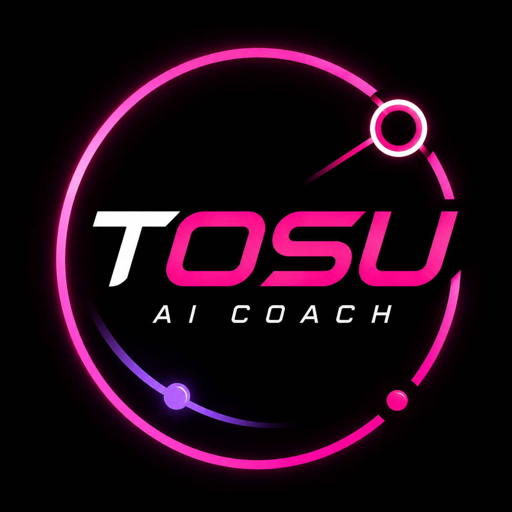

# TOSU AI Coach

<p align="center">
  
</p>

<p align="center"><strong>Un coach osu! local, utile, drôle et sans clé API développeur.</strong></p>

Un coach osu! local qui transforme chaque fin de partie — réussite, fail ou abandon — en retour utile, suivi de progression et chambrage entre potes. Le but n’est pas d’afficher un tableau Excel de plus : le coach célèbre les petits progrès, tire une leçon des mauvaises games et propose une prochaine action concrète.

Il fonctionne avec **Claude CLI et/ou Codex CLI, sans clé API développeur**. Il réutilise la session déjà connectée à l’outil choisi : aucune clé à créer, aucun secret à copier et aucune facturation API séparée.

> « Sans API » signifie ici sans clé API ni intégration développeur à configurer. Claude CLI ou Codex CLI doit être installé et connecté avec un abonnement compatible ; leurs conditions et limites d’usage continuent de s’appliquer.

## Fonctionnalités

- Analyse automatique via l’API locale TOSU.
- Détection des maps terminées, fails et abandons.
- Affichage immédiat de la map lancée et du dernier score connu sur la même difficulté.
- Conseils courts sur le timing, l’aim, la speed ou la lecture.
- Conseils de pause espacés d’au moins 60 minutes, déclenchés seulement par une baisse durable ou une série d’échecs prolongée.
- Ton de pote : humour, cynisme et chambrage affectueux.
- Cinq personnalités : équilibré, bienveillant, sarcastique, compétiteur ou analyste.
- Nom du coach personnalisable dans le tableau de bord.
- Valorisation des progrès sans inventer de performance.
- Historique local et suivi entre les sessions.
- Routine de trois maps d’échauffement choisies dans l’historique et la zone d’étoiles confortable.
- Détection des nouvelles sessions (90 minutes par défaut) et des nouvelles journées, avec résumé express de la session précédente et priorité du jour.
- Recommandation prudente d’offset avec suffisamment de données cohérentes.
- Annulation de la génération si une nouvelle map commence.
- Détection de la fermeture d’osu! : analyses annulées, session arrêtée et overlay masqué.
- Bascule automatique entre Claude et Codex.
- Réponse dans la langue de Windows, avec possibilité de forcer une langue.
- Overlay portrait 9:16 permanent.
- Affichage au choix : toujours visible ou temporisé (20 secondes par défaut).
- Logo officiel TOSU AI Coach intégré à l’overlay.
- Données privées dans `%LOCALAPPDATA%\TosuAICoach`.

## Prérequis

- Windows 10 ou 11.
- [Node.js](https://nodejs.org/) 20 ou plus récent.
- [TOSU](https://github.com/tosuapp/tosu) 4.25 ou plus récent.
- osu!lazer ou osu!stable compatible avec TOSU.
- Au moins un fournisseur IA installé et connecté : Codex CLI avec un compte ChatGPT compatible, ou Claude Code avec un compte Claude compatible.
- Une connexion Internet pendant les analyses IA.

### Fournisseur IA obligatoire

Le coach n’embarque aucun modèle et n’utilise aucune clé API développeur par défaut. Il lance localement **Codex CLI** ou **Claude Code**, qui doit déjà être authentifié. Un compte créé mais non connecté dans le CLI ne suffit pas. Les quotas et limites du forfait choisi continuent de s’appliquer.

Option Codex :

```powershell
npm install -g @openai/codex
codex
```

Au premier lancement, choisis la connexion avec ChatGPT et termine l’authentification dans le navigateur. Ferme ensuite Codex une fois le test terminé.

Option Claude :

```powershell
npm install -g @anthropic-ai/claude-code
claude
```

Au premier lancement, connecte un compte Claude.ai avec un forfait compatible, ou utilise une méthode Anthropic Console correctement facturée. Le mode natif Windows de Claude Code nécessite également Git for Windows selon la méthode d’installation choisie.

Tu peux installer les deux : le mode `auto` essaiera l’un puis l’autre en cas de quota ou d’indisponibilité.

> **Aucun serveur MCP, plugin Codex, connecteur ChatGPT ou extension Claude n’est nécessaire.** MCP sert à connecter des données et outils externes ; TOSU AI Coach communique uniquement avec l’API locale TOSU et les commandes CLI installées.

## Installation rapide

Dans PowerShell, depuis le dossier du projet :

```powershell
Set-ExecutionPolicy -Scope Process Bypass
.\scripts\install.ps1
```

L’installateur détecte TOSU lorsqu’il tourne, copie le counter, initialise les données et crée un raccourci de démarrage Windows.

Ensuite :

1. Lance TOSU et osu!.
2. Appuie sur `Shift+F2` dans osu!.
3. Active `Coach IA` et place le panneau.
4. Termine ou abandonne une map.

## Tableau de bord local

Quand le service tourne, ouvre [http://127.0.0.1:24051/dashboard](http://127.0.0.1:24051/dashboard).

- **Profil joueur** : règle la zone d’étoiles, le rank, les objectifs et les points faibles sans modifier de JSON.
- **Sessions** : consulte les runs, maps uniques, accuracy, UR, misses, difficulté moyenne, meilleur résultat et priorité calculée.
- **Progression** : visualise les tendances d’accuracy, UR, misses et étoiles sur 7 ou 30 jours.

Le tableau de bord reste strictement local et utilise uniquement les données de `%LOCALAPPDATA%\TosuAICoach`.

Vérifie enfin les fournisseurs détectés :

```powershell
.\scripts\doctor.ps1
node coach-service.js --test-providers
```

Au moins un fournisseur doit répondre correctement. Si les deux échouent, relance `codex` ou `claude` dans un terminal pour terminer la connexion, puis refais le test.

## Données utilisateur

```text
%LOCALAPPDATA%\TosuAICoach\
├── config.json
├── history.json
├── last-state.json
├── install.json
└── logs\
    └── coach.log
```

Ces fichiers sont créés automatiquement et ne doivent jamais être commités. Une mise à jour du programme ne supprime pas la progression.

## Fournisseurs IA

Dans `%LOCALAPPDATA%\TosuAICoach\config.json` :

```json
{
  "provider": "auto",
  "claude_first": true,
  "language": "auto"
}
```

- `auto` essaie les deux fournisseurs dans l’ordre choisi.
- `claude` utilise uniquement Claude CLI.
- `codex` utilise uniquement Codex CLI.
- `language: auto` suit la langue de Windows ; une valeur comme `fr`, `en`, `de` ou `ja` force la langue des réponses.

Les exécutables sont détectés automatiquement. `CLAUDE_PATH` et `CODEX_PATH` permettent de forcer un chemin.

## Documentation

- [Configuration](docs/CONFIGURATION.md)
- [Base de connaissances coaching](docs/COACHING_KNOWLEDGE.md)
- [Architecture](docs/ARCHITECTURE.md)
- [Développement et forks](docs/DEVELOPMENT.md)
- [Dépannage](docs/TROUBLESHOOTING.md)
- [Vie privée](docs/PRIVACY.md)
- [Contribuer](CONTRIBUTING.md)
- [Sécurité](SECURITY.md)

## Développement

```powershell
npm test
npm run check
node coach-service.js
```

Le projet n’a aucune dépendance npm en production.

## Statut et licence

Le projet est jeune : les formats peuvent évoluer avant la version 1.0. Contributions et retours sont bienvenus. Licence [MIT](LICENSE).
